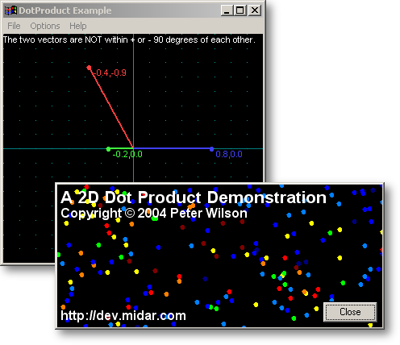



## A 2D DotProduct Demonstration

### Description

This application is a simple and clear demonstration of the DotProduct in two dimensions. The DotProduct is almost always used by game programmers, especially in shooting games like Unreal Tournament. The DotProduct allows the programmers to decide is the user is pointing his weapon at a monster, a pickup or a door. The DotProduct is also used for Back-Face culling and lighting effects. You can even use the DotProduct for real world physics calculations like "Newton's Conservation of Momentum". In fact, this is the real reason I created this little demo. I'm currently working on my Asteroids game (also on PSC) and wanted the Asteroids to bounce off each other convincingly. Since angles were involved, I figured I could probably use the DotProduct to save on calculations. I needed a little refresher course in the DotProduct, thus this project was born. If you are not interested in the DotProduct, you may be interested in the Splash screen. It has a built in Ant Simulator which probably deserves it's own submission.
 
### More Info
 

             |
---                |---
**Submitted On**   |2004-03-17 10:41:52
**By**             |[Peter Wilson](https://github.com/Planet-Source-Code/PSCIndex/blob/master/ByAuthor/peter-wilson.md)
**Level**          |Beginner
**User Rating**    |4.8 (24 globes from 5 users)
**Compatibility**  |VB 6\.0
**Category**       |[Graphics](https://github.com/Planet-Source-Code/PSCIndex/blob/master/ByCategory/graphics__1-46.md)
**World**          |[Visual Basic](https://github.com/Planet-Source-Code/PSCIndex/blob/master/ByWorld/visual-basic.md)
**Archive File**   |[A\_2D\_DotPr1721133172004\.zip](https://github.com/Planet-Source-Code/peter-wilson-a-2d-dotproduct-demonstration__1-52436/archive/master.zip)

